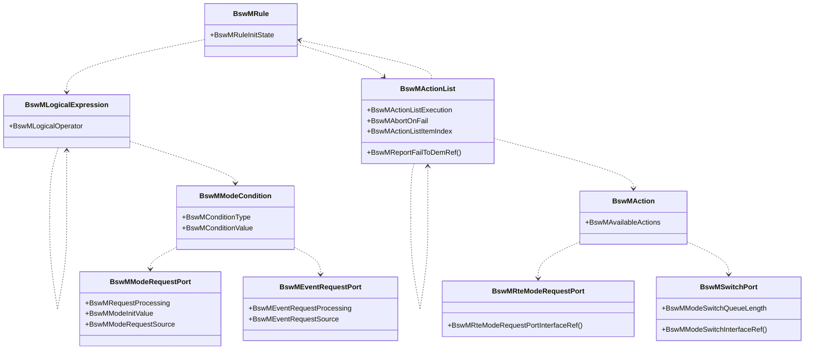
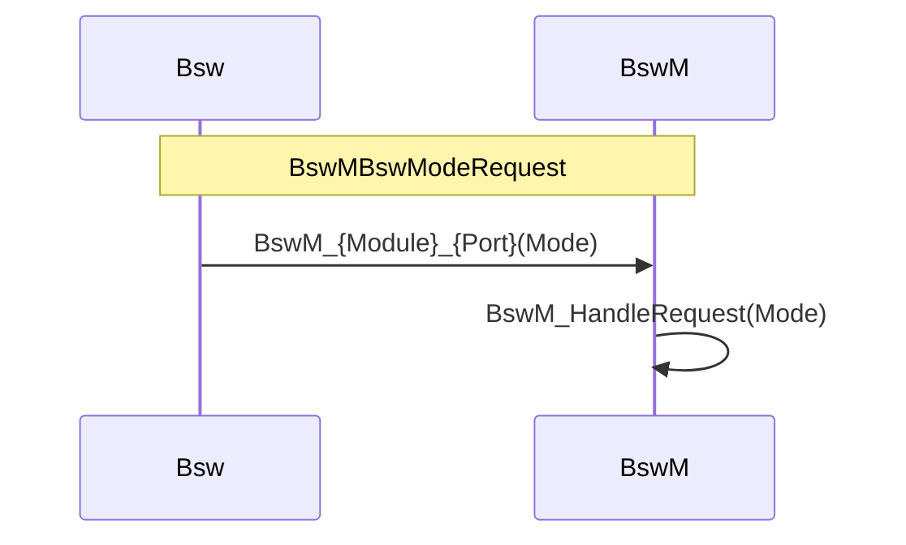
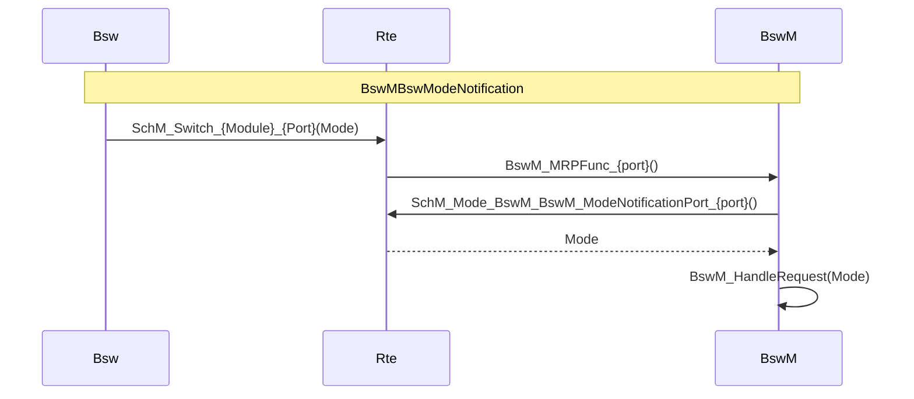
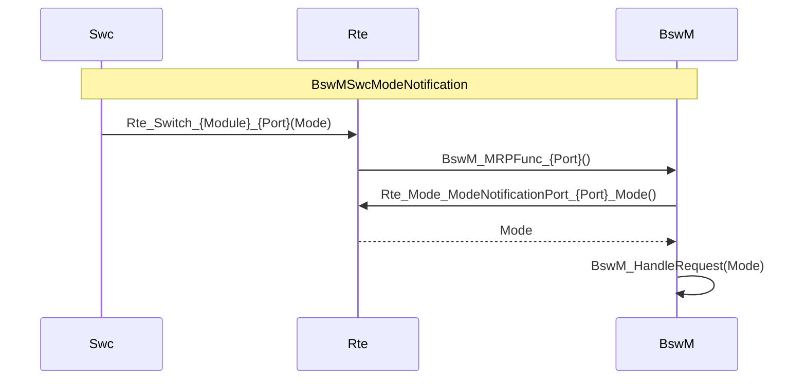
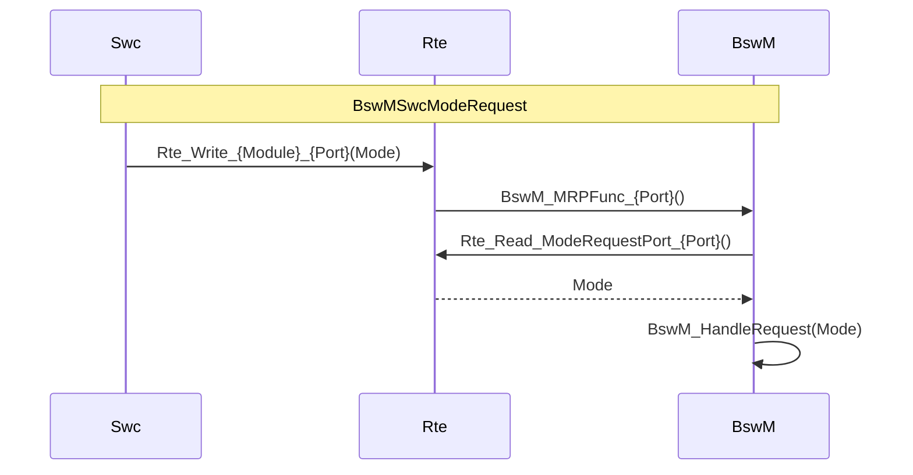
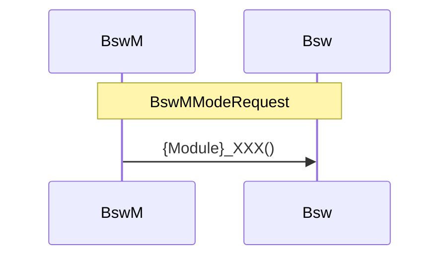
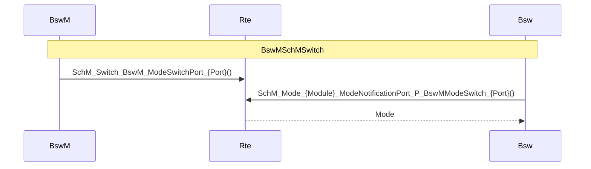
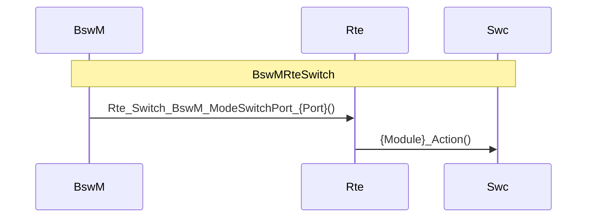
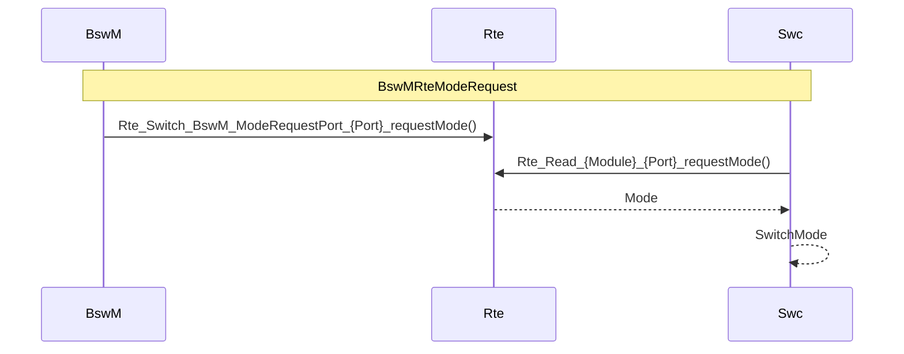

| BswMRuleInitState | 初始状态值                                                   |
| ----------------- | ------------------------------------------------------------ |
| BSWM_FALSE        | 该规则在初始化时为假状态。                                   |
| BSWM_TRUE         | 该规则在初始化时为真状态。                                   |
| BSWM_UNDEFINED    | 该规则在初始化时没有明确的初始状态，它的状态将根据后续的输入事件动态决定。 |

| BswMActionListExecution | 执行方式                                   |
| ----------------------- | ------------------------------------------ |
| BSWM_CONDITION          | 条件执行，即每次评估规则时被执行。         |
| BSWM_TRIGGER            | 触发执行，即每次评估结果发生变化时才执行。 |

在初始化后第一次评估规则时根据下表中的规定进行操作。

| BswMRuleInitState | BswMActionListExecution | Rule evaluated to True   | Rule evaluated to False   |
| ----------------- | ----------------------- | ------------------------ | ------------------------- |
| BSWM_UNDEFINED    | BSWM_CONDITION          | Execute True Action List | Execute False Action List |
| BSWM_FALSE        | BSWM_CONDITION          | Execute True Action List | Execute False Action List |
| BSWM_TRUE         | BSWM_CONDITION          | Execute True Action List | Execute False Action List |
| BSWM_UNDEFINED    | BSWM_TRIGGER            | Execute True Action List | Execute False Action List |
| BSWM_FALSE        | BSWM_TRIGGER            | Execute True Action List | Do Nothing                |
| BSWM_TRUE         | BSWM_TRIGGER            | Do Nothing               | Execute False Action List |

| BswMLogicalOperator | 逻辑运算符                                                   |
| ------------------- | ------------------------------------------------------------ |
| BSWM_AND            | 逻辑“与”运算符。所有输入条件都为真时，整个表达式才为真。     |
| BSWM_NAND           | 逻辑“与非”运算符。至少有一个输入条件为假时，整个表达式为真。 |
| BSWM_OR             | 逻辑“或”运算符。任意一个输入条件为真时，整个表达式即为真。   |
| BSWM_XOR            | 逻辑“异或”运算符。当且仅当一个输入条件为真时，整个表达式为真。 |

| BswMConditionType | 比较运算符                                                   |
| ----------------- | ------------------------------------------------------------ |
| BSWM_EQUALS       | 比较运算符“等于”。用于检查一个信号或状态是否等于指定的值。   |
| BSWM_EQUALS_NOT   | 比较运算符“不等于”。用于检查一个信号或状态是否不等于指定的值。 |

| BswMRequestProcessing | 处理策略                                                     |
| --------------------- | ------------------------------------------------------------ |
| BSWM_IMMEDIATE        | 立即处理。当触发事件发生时，BswM会立刻执行相关联的动作或配置更改。适用于需要快速响应的事件，如安全关键功能。 |
| BSWM_DEFERRED         | 延迟处理。当触发事件发生时，BswM不会立即执行相关联的动作，而是将其推迟到稍后的某个时间点（如下一个调度周期或特定的同步点）。适用于对实时性要求不高、可以稍后处理的任务，有助于优化系统资源。 |

| BswMModeRequestSource                | API                                                          | ASR  | EB   |
| ------------------------------------ | ------------------------------------------------------------ | ---- | ---- |
| BswMGenericRequest                   | BswM_RequestMode                                             | √    | √    |
| BswMEcuMIndication                   | BswM_EcuM_CurrentState                                       | √    | √    |
| BswMEcuMWakeupSource                 | BswM_EcuM_CurrentWakeup                                      | √    | √    |
| BswMEcuMRUNRequestIndication         | BswM_EcuM_RequestedState                                     | √    | ×    |
| BswMNvMRequest                       | BswM_NvM_CurrentBlockMode                                    | √    | √    |
| BswMNvMJobModeIndication             | BswM_NvM_CurrentJobMode                                      | √    | √    |
| BswMComMIndication                   | BswM_ComM_CurrentMode                                        | √    | √    |
| BswMComMPncRequest                   | BswM_ComM_CurrentPNCMode                                     | √    | √    |
| BswMCanSMIndication                  | BswM_CanSM_CurrentState                                      | √    | √    |
| BswMLinSMIndication                  | BswM_LinSM_CurrentState                                      | √    | √    |
| BswMLinScheduleIndication            | BswM_LinSM_CurrentSchedule                                   | √    | √    |
| BswMLinTpModeRequest                 | BswM_LinTp_RequestMode                                       | √    | √    |
| BswMFrSMIndication                   | BswM_FrSM_CurrentState                                       | √    | √    |
| BswMEthSMIndication                  | BswM_EthSM_CurrentState                                      | √    | √    |
| BswMEthIfPortGroupLinkStateChg       | BswM_EthIf_PortGroupLinkStateChg                             | √    | √    |
| BswMSoAdSoConModeChg                 | -                                                            | √    | ×    |
| BswMSdClientServiceCurrentState      | BswM_Sd_ClientServiceCurrentState                            | √    | √    |
| BswMSdConsumedEventGroupCurrentState | BswM_Sd_ConsumedEventGroupCurrentState                       | √    | √    |
| BswMSdEventHandlerCurrentState       | BswM_Sd_EventHandlerCurrentState                             | √    | √    |
| BswMNmStateChangeNotification        | BswM_Nm_StateChangeNotification                              | √    | ×    |
| BswMJ1939NmIndication                | BswM_J1939Nm_StateChangeNotification                         | √    | √    |
| BswMJ1939DcmBroadcastStatus          | BswM_J1939DcmBroadcastStatus                                 | √    | √    |
| BswMDcmComModeCurrentState           | BswM_Dcm_CommunicationMode_CurrentState                      | √    | √    |
| BswMDcmComModeRequest                | BswM_Dcm_RequestCommunicationMode                            | ×    | √    |
| BswMDcmSessionModeRequest            | BswM_Dcm_RequestSessionMode                                  | ×    | √    |
| BswMDcmResetModeRequest              | BswM_Dcm_RequestResetMode                                    | ×    | √    |
| BswMBswModeNotification              | SchM_Switch_Dcm_DcmDiagnosticSessionControl SchM_Switch_Dcm_DcmEcuReset SchM_Switch_Dcm_DcmRapidPowerShutdown SchM_Switch_Dcm_DcmCommunicationControl SchM_Switch_Dcm_DcmControlDTCSetting SchM_Switch_{Module} _{Port} | √    | √    |
| BswMSwcModeNotification              | Rte_Switch_{Module} _{Port}                                  | √    | √    |
| BswMSwcModeRequest                   | Rte_Write_{Module} _{Port}                                   | √    | √    |
| BswMTimer                            | -                                                            | √    | √    |

| BswMEventRequestSource              | API                             | ASR  | EB   |
| ----------------------------------- | ------------------------------- | ---- | ---- |
| BswMPartitionRestarted              | BswM_BswMPartitionRestarted     | √    | ×    |
| BswMWdgMRequestPartitionReset       | BswM_WdgM_RequestPartitionReset | ×    | √    |
| BswMComMInitiateReset               | BswM_ComM_InitiateReset         | √    | ×    |
| BswMNmCarWakeUpIndication           | BswM_Nm_CarWakeUpIndication     | √    | √    |
| BswMDcmApplicationUpdatedIndication | BswM_Dcm_ApplicationUpdated     | √    | √    |
| BswMRteSwitchAckNotification        | -                               | √    | √    |
| BswMModeSwitchErrorEvent            | -                               | √    | ×    |

| BswMAvailableActions                | API                                                 | ASR  | EB   |
| ----------------------------------- | --------------------------------------------------- | ---- | ---- |
| BswMClearEventRequest               | -                                                   | √    | √    |
| BswMCoreHaltMode                    | -                                                   | √    | ×    |
| BswMEcuMSelectShutdownTarget        | EcuM_SelectShutdownTarget                           | √    | √    |
| BswMEcuMGoDownHaltPoll              | EcuM_GoDown EcuM_GoHalt EcuM_GoPoll       | √    | √    |
| BswMEcuMDriverInitListBswM          | -                                                   | √    | ×    |
| BswMEcuMStateSwitch                 | EcuM_SetState                                       | √    | ×    |
| BswMPduRouterControl                | PduR_EnableRouting PduR_DisableRouting         | √    | √    |
| BswMComMAllowCom                    | ComM_CommunicationAllowed                           | √    | √    |
| BswMComMModeLimitation              | ComM_LimitChannelToNoComMode                        | √    | √    |
| BswMComMModeSwitch                  | ComM_RequestComMode                                 | √    | √    |
| BswMDeadlineMonitoringControl       | Com_EnableReceptionDM Com_DisableReceptionDM   | √    | √    |
| BswMPduGroupSwitch                  | Com_IpduGroupStart Com_IpduGroupStop           | √    | √    |
| BswMSwitchIPduMode                  | Com_SwitchIpduTxMode                                | √    | √    |
| BswMTriggerIPduSend                 | Com_TriggerIPDUSend                                 | √    | √    |
| BswMLinScheduleSwitch               | LinSM_ScheduleRequest                               | √    | √    |
| BswMFrSMAllSlots                    | FrSM_AllSlots                                       | √    | ×    |
| BswMEthIfStartAllPorts              | EthIf_StartAllPorts                                 | √    | ×    |
| BswMEthIfSwitchPortGroupRequestMode | EthIf_SwitchPortGroupRequestMode                    | √    | √    |
| BswMSdClientServiceModeRequest      | Sd_ClientServiceSetState                            | √    | √    |
| BswMSdConsumedEventGroupModeRequest | Sd_ConsumedEventGroupSetState                       | √    | √    |
| BswMSdServerServiceModeRequest      | Sd_ServerServiceSetState                            | √    | √    |
| BswMSdServiceGroupSwitch            | Sd_ServiceGroupStart Sd_ServiceGroupStop       | √    | ×    |
| BswMNMControl                       | Nm_EnableCommunication Nm_DisableCommunication | √    | √    |
| BswMIdsMBlockStateChangeRequest     |                                                     | √    | √    |
| BswMJ1939DcmStateSwitch             | J1939Dcm_SetState                                   | √    | √    |
| BswMJ1939RmStateSwitch              | J1939Rm_SetState                                    | √    | √    |
| BswMRteStart                        | Rte_Start_[OsApplication]                           | √    | ×    |
| BswMRteStop                         | Rte_Stop_[OsApplication]                            | √    | ×    |
| BswMRteModeRequest                  | Rte_Write_BswM_ModeRequestPort_{Port}               | √    | √    |
| BswMRteSwitch                       | Rte_Switch_BswM_ModeSwitchPort_{Port}               | √    | √    |
| BswMSchMSwitch                      | SchM_Switch_BswM_ModeSwitchPort_{Port}              | √    | √    |
| BswMTimerControl                    | -                                                   | √    | √    |
| BswMUserCallout                     | -                                                   | √    | √    |

