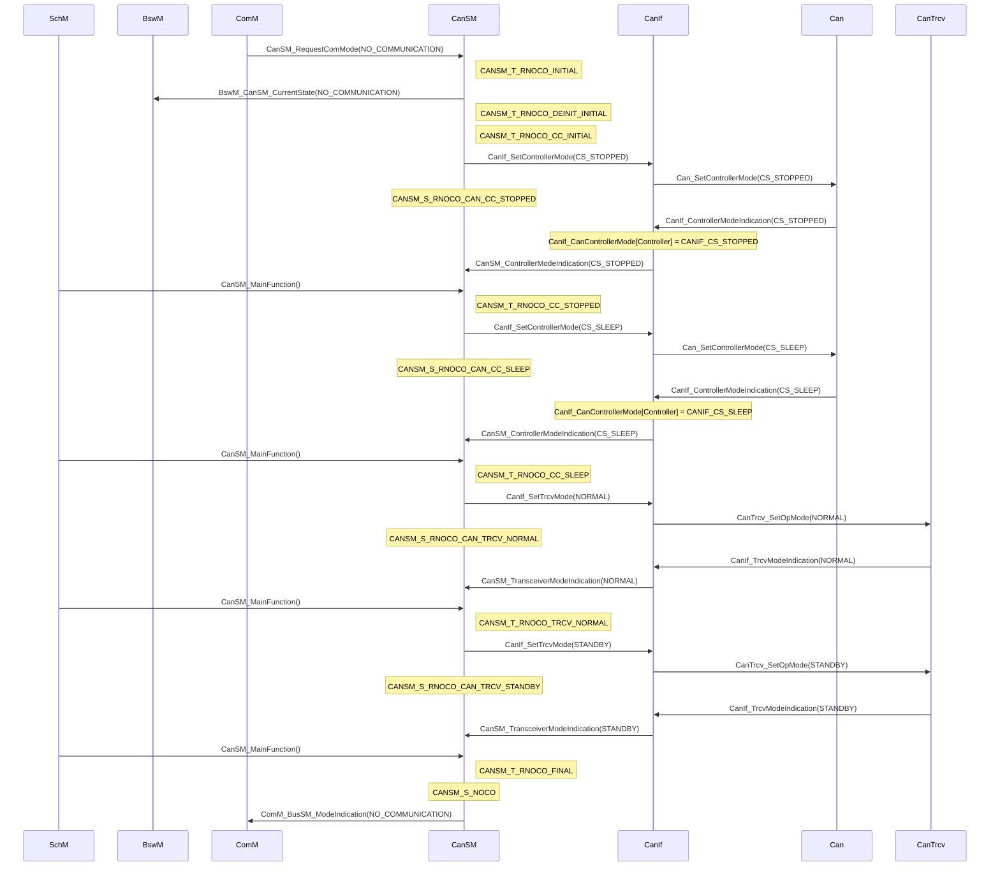
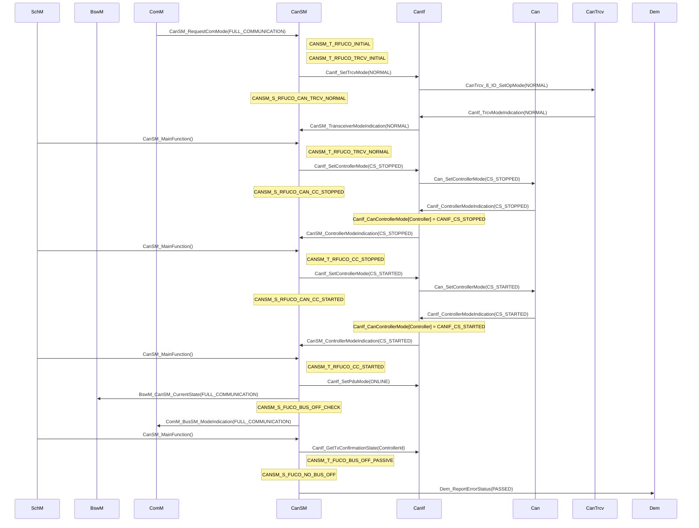
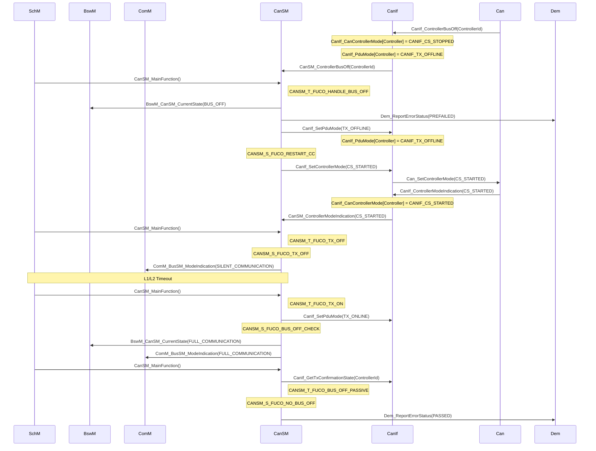

Request No Communication:

```mermaid
sequenceDiagram

participant SchM
participant BswM
participant ComM
participant CanSM
participant CanIf
participant Can
participant CanTrcv

ComM->>CanSM:CanSM_RequestComMode(NO_COMMUNICATION)
Note right of CanSM:CANSM_T_RNOCO_INITIAL
CanSM->>BswM:BswM_CanSM_CurrentState(NO_COMMUNICATION)
Note right of CanSM:CANSM_T_RNOCO_DEINIT_INITIAL
Note right of CanSM:CANSM_T_RNOCO_CC_INITIAL
CanSM->>CanIf:CanIf_SetControllerMode(CS_STOPPED)
CanIf->>Can:Can_SetControllerMode(CS_STOPPED)
Note over CanSM:CANSM_S_RNOCO_CAN_CC_STOPPED

Can->>CanIf:CanIf_ControllerModeIndication(CS_STOPPED)
Note over CanIf:CanIf_CanControllerMode[Controller] = CANIF_CS_STOPPED
CanIf->>CanSM:CanSM_ControllerModeIndication(CS_STOPPED)

SchM->>CanSM:CanSM_MainFunction()
Note right of CanSM:CANSM_T_RNOCO_CC_STOPPED
CanSM->>CanIf:CanIf_SetControllerMode(CS_SLEEP)
CanIf->>Can:Can_SetControllerMode(CS_SLEEP)
Note over CanSM:CANSM_S_RNOCO_CAN_CC_SLEEP

Can->>CanIf:CanIf_ControllerModeIndication(CS_SLEEP)
Note over CanIf:CanIf_CanControllerMode[Controller] = CANIF_CS_SLEEP
CanIf->>CanSM:CanSM_ControllerModeIndication(CS_SLEEP)

SchM->>CanSM:CanSM_MainFunction()
Note right of CanSM:CANSM_T_RNOCO_CC_SLEEP
CanSM->>CanIf:CanIf_SetTrcvMode(NORMAL)
CanIf->>CanTrcv:CanTrcv_SetOpMode(NORMAL)
Note over CanSM:CANSM_S_RNOCO_CAN_TRCV_NORMAL

CanTrcv->>CanIf:CanIf_TrcvModeIndication(NORMAL)
CanIf->>CanSM:CanSM_TransceiverModeIndication(NORMAL)

SchM->>CanSM:CanSM_MainFunction()
Note right of CanSM:CANSM_T_RNOCO_TRCV_NORMAL
CanSM->>CanIf:CanIf_SetTrcvMode(STANDBY)
CanIf->>CanTrcv:CanTrcv_SetOpMode(STANDBY)
Note over CanSM:CANSM_S_RNOCO_CAN_TRCV_STANDBY

CanTrcv->>CanIf:CanIf_TrcvModeIndication(STANDBY)
CanIf->>CanSM:CanSM_TransceiverModeIndication(STANDBY)

SchM->>CanSM:CanSM_MainFunction()
Note right of CanSM:CANSM_T_RNOCO_FINAL
Note over CanSM:CANSM_S_NOCO
CanSM->>ComM:ComM_BusSM_ModeIndication(NO_COMMUNICATION)
```

Request Full Communication：

```mermaid
sequenceDiagram

participant SchM
participant BswM
participant ComM
participant CanSM
participant CanIf
participant Can
participant CanTrcv
participant Dem

ComM->>CanSM:CanSM_RequestComMode(FULL_COMMUNICATION)
Note right of CanSM:CANSM_T_RFUCO_INITIAL
Note right of CanSM:CANSM_T_RFUCO_TRCV_INITIAL
CanSM->>CanIf:CanIf_SetTrcvMode(NORMAL)
CanIf->>CanTrcv:CanTrcv_8_IO_SetOpMode(NORMAL)
Note over CanSM:CANSM_S_RFUCO_CAN_TRCV_NORMAL

CanTrcv->>CanIf:CanIf_TrcvModeIndication(NORMAL)
CanIf->>CanSM:CanSM_TransceiverModeIndication(NORMAL)

SchM->>CanSM:CanSM_MainFunction()
Note right of CanSM:CANSM_T_RFUCO_TRCV_NORMAL
CanSM->>CanIf:CanIf_SetControllerMode(CS_STOPPED)
CanIf->>Can:Can_SetControllerMode(CS_STOPPED)
Note over CanSM:CANSM_S_RFUCO_CAN_CC_STOPPED

Can->>CanIf:CanIf_ControllerModeIndication(CS_STOPPED)
Note over CanIf:CanIf_CanControllerMode[Controller] = CANIF_CS_STOPPED
CanIf->>CanSM:CanSM_ControllerModeIndication(CS_STOPPED)

SchM->>CanSM:CanSM_MainFunction()
Note right of CanSM:CANSM_T_RFUCO_CC_STOPPED
CanSM->>CanIf:CanIf_SetControllerMode(CS_STARTED)
CanIf->>Can:Can_SetControllerMode(CS_STARTED)
Note over CanSM:CANSM_S_RFUCO_CAN_CC_STARTED

Can->>CanIf:CanIf_ControllerModeIndication(CS_STARTED)
Note over CanIf:CanIf_CanControllerMode[Controller] = CANIF_CS_STARTED
CanIf->>CanSM:CanSM_ControllerModeIndication(CS_STARTED)

SchM->>CanSM:CanSM_MainFunction()
Note right of CanSM:CANSM_T_RFUCO_CC_STARTED
CanSM->>CanIf:CanIf_SetPduMode(ONLINE)
CanSM->>BswM:BswM_CanSM_CurrentState(FULL_COMMUNICATION)
Note over CanSM:CANSM_S_FUCO_BUS_OFF_CHECK
CanSM->>ComM:ComM_BusSM_ModeIndication(FULL_COMMUNICATION)

SchM->>CanSM:CanSM_MainFunction()
CanSM->>CanIf:CanIf_GetTxConfirmationState(ControllerId)
Note right of CanSM:CANSM_T_FUCO_BUS_OFF_PASSIVE
Note over CanSM:CANSM_S_FUCO_NO_BUS_OFF
CanSM->>Dem:Dem_ReportErrorStatus(PASSED)
```

Controller Bus Off

```mermaid
sequenceDiagram

participant SchM
participant BswM
participant ComM
participant CanSM
participant CanIf
participant Can
participant Dem

Can->>CanIf:CanIf_ControllerBusOff(ControllerId)
Note over CanIf:CanIf_CanControllerMode[Controller] = CANIF_CS_STOPPED
Note over CanIf:CanIf_PduMode[Controller] = CANIF_TX_OFFLINE
CanIf->>CanSM:CanSM_ControllerBusOff(ControllerId)

SchM->>CanSM:CanSM_MainFunction()
Note right of CanSM:CANSM_T_FUCO_HANDLE_BUS_OFF
CanSM->>BswM:BswM_CanSM_CurrentState(BUS_OFF)
CanSM->>Dem:Dem_ReportErrorStatus(PREFAILED)
CanSM->>CanIf:CanIf_SetPduMode(TX_OFFLINE)
Note over CanIf:CanIf_PduMode[Controller] = CANIF_TX_OFFLINE
Note over CanSM:CANSM_S_FUCO_RESTART_CC
CanSM->>CanIf:CanIf_SetControllerMode(CS_STARTED)
CanIf->>Can:Can_SetControllerMode(CS_STARTED)

Can->>CanIf:CanIf_ControllerModeIndication(CS_STARTED)
Note over CanIf:CanIf_CanControllerMode[Controller] = CANIF_CS_STARTED
CanIf->>CanSM:CanSM_ControllerModeIndication(CS_STARTED)

SchM->>CanSM:CanSM_MainFunction()
Note right of CanSM:CANSM_T_FUCO_TX_OFF
Note over CanSM:CANSM_S_FUCO_TX_OFF
CanSM->>ComM:ComM_BusSM_ModeIndication(SILENT_COMMUNICATION)

Note over SchM,CanSM:L1/L2 Timeout

SchM->>CanSM:CanSM_MainFunction()
Note right of CanSM:CANSM_T_FUCO_TX_ON
CanSM->>CanIf:CanIf_SetPduMode(TX_ONLINE)
Note over CanSM:CANSM_S_FUCO_BUS_OFF_CHECK
CanSM->>BswM:BswM_CanSM_CurrentState(FULL_COMMUNICATION)
CanSM->>ComM:ComM_BusSM_ModeIndication(FULL_COMMUNICATION)

SchM->>CanSM:CanSM_MainFunction()
CanSM->>CanIf:CanIf_GetTxConfirmationState(ControllerId)
Note right of CanSM:CANSM_T_FUCO_BUS_OFF_PASSIVE
Note over CanSM:CANSM_S_FUCO_NO_BUS_OFF
CanSM->>Dem:Dem_ReportErrorStatus(PASSED)
```

