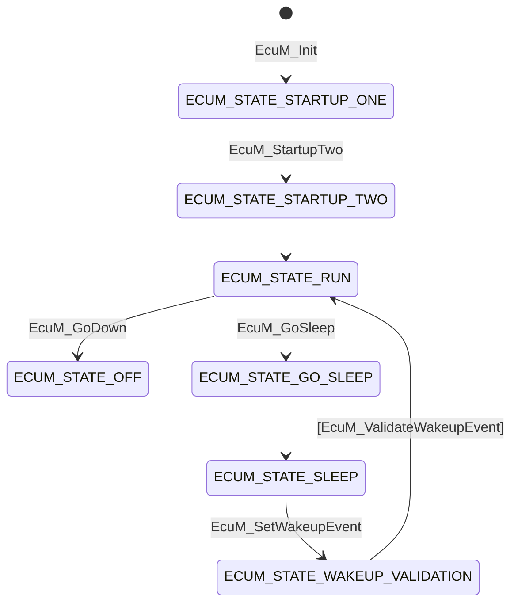
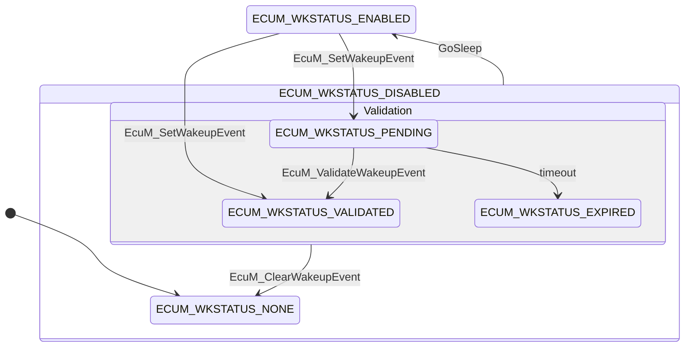
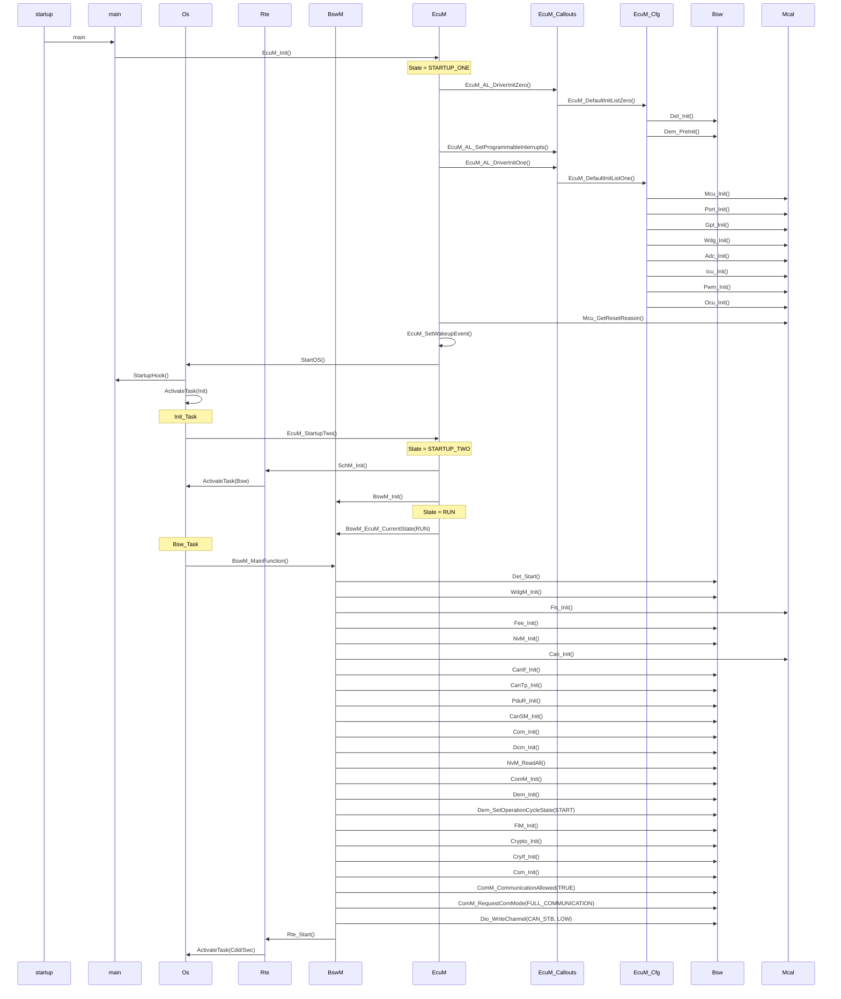
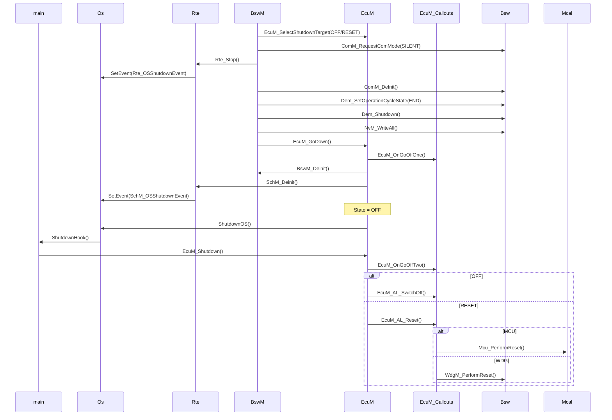
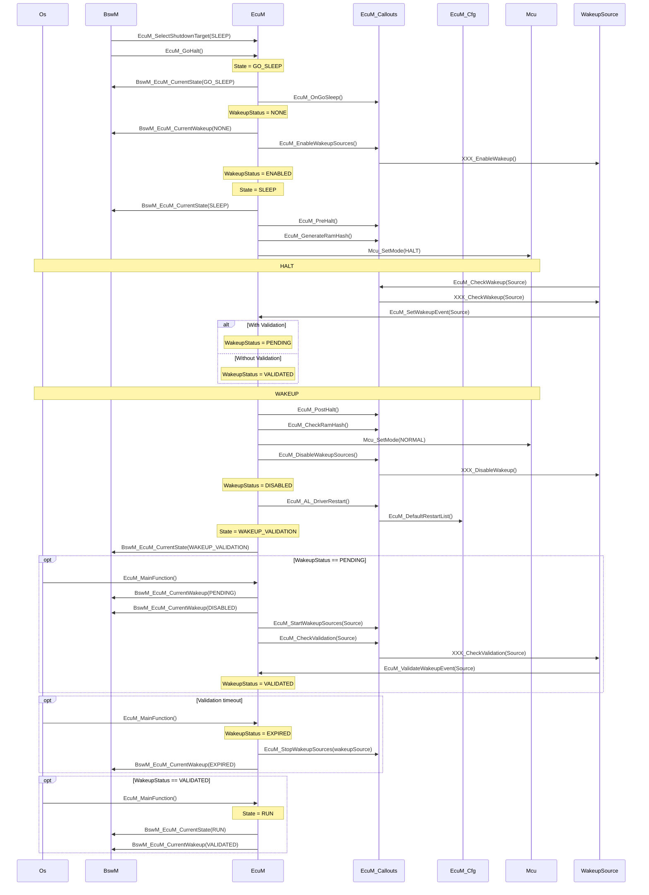
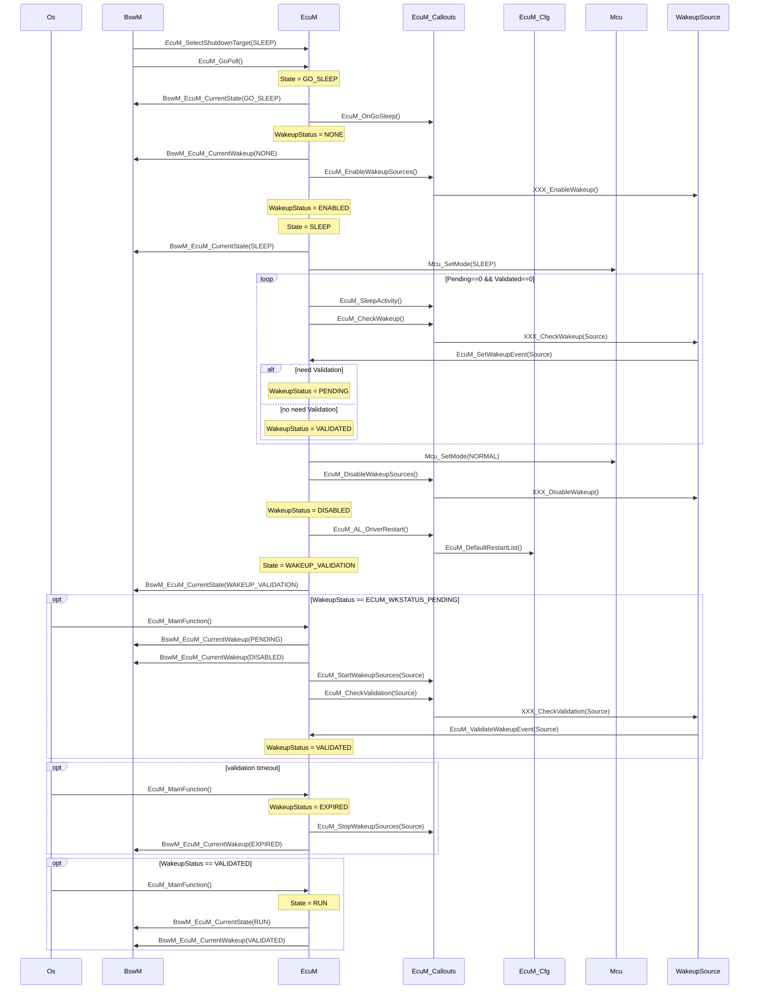
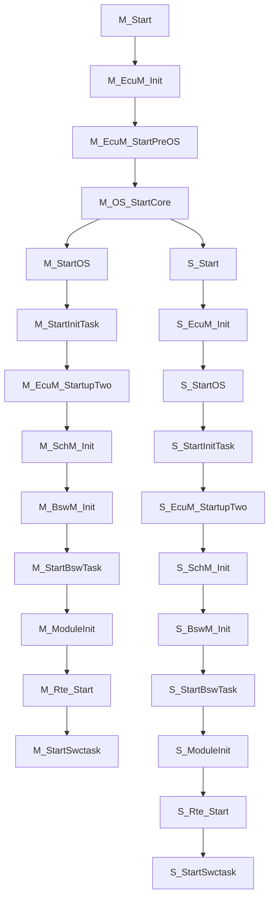
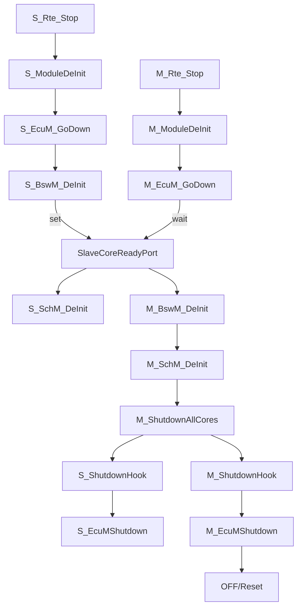
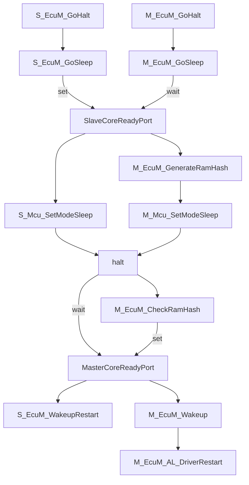
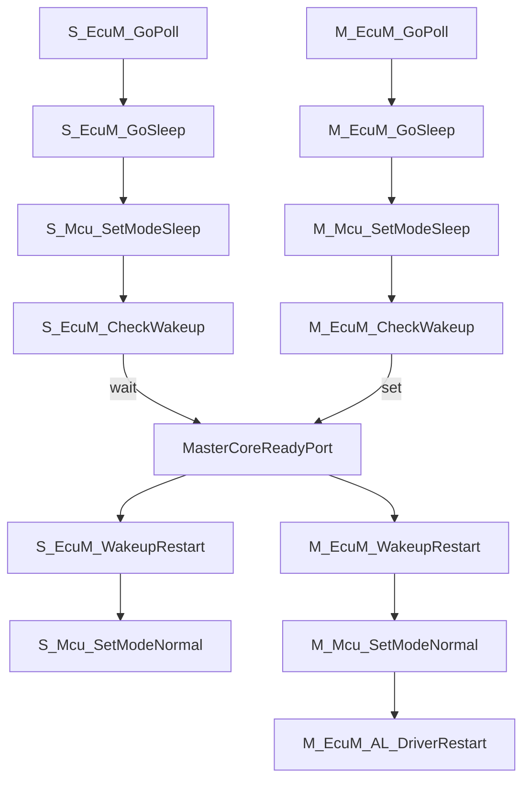

| WakeupSource                 |        |
| ---------------------------- | ------ |
| ECUM_WKSOURCE_POWER          | Fix    |
| ECUM_WKSOURCE_RESET          | Fix    |
| ECUM_WKSOURCE_INTERNAL_RESET | Fix    |
| ECUM_WKSOURCE_INTERNAL_WDG   | Fix    |
| ECUM_WKSOURCE_EXTERNAL_WDG   | Fix    |
| ECUM_WKSOURCE_XXX            | Config |

| WakeupStatus            |                                      |
| ----------------------- | ------------------------------------ |
| ECUM_WKSTATUS_NONE      | 没有检测到唤醒事件或者唤醒事件被清除 |
| ECUM_WKSTATUS_PENDING   | 检测到唤醒事件，但尚未验证           |
| ECUM_WKSTATUS_VALIDATED | 检测到唤醒事件，并成功验证           |
| ECUM_WKSTATUS_EXPIRED   | 检测到唤醒事件，但验证失败           |
| ECUM_WKSTATUS_DISABLED  | 唤醒源被禁止                         |
| ECUM_WKSTATUS_ENABLED   | 唤醒源被使能                         |

Startup：

Shutdown：

Sleep(Halt)

Sleep(Poll)

MutilCore Start

MutilCore Stop

MutilCore Sleep(Halt)

MutilCore Sleep(Poll)

