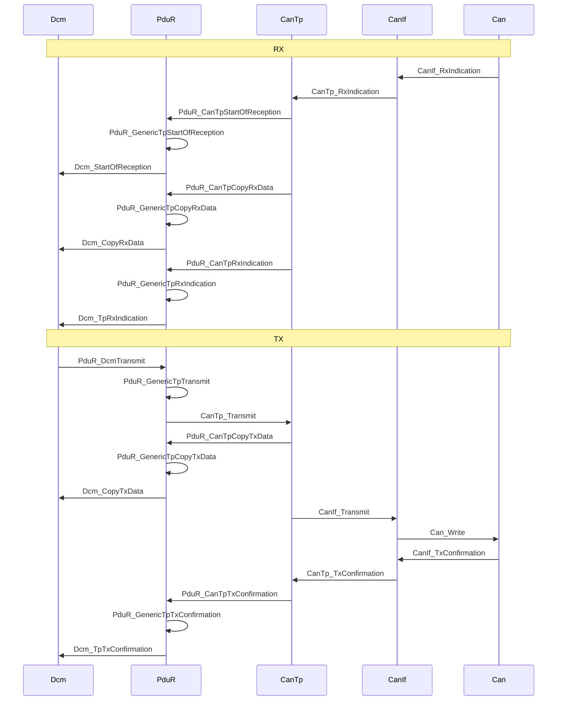
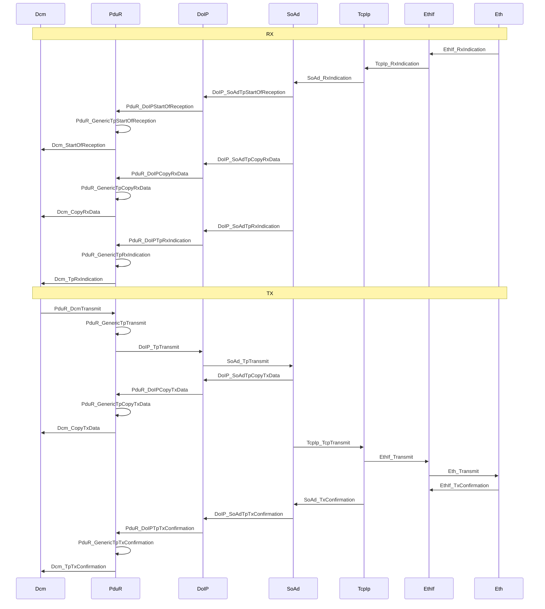

```mermaid
sequenceDiagram

participant Dcm
participant PduR
participant CanTp
participant CanIf
participant Can

note over Dcm,Can:RX

Can->>CanIf:CanIf_RxIndication
CanIf->>CanTp:CanTp_RxIndication
CanTp->>PduR:PduR_CanTpStartOfReception
PduR->>PduR:PduR_GenericTpStartOfReception
PduR->>Dcm:Dcm_StartOfReception

CanTp->>PduR:PduR_CanTpCopyRxData
PduR->>PduR:PduR_GenericTpCopyRxData
PduR->>Dcm:Dcm_CopyRxData

CanTp->>PduR:PduR_CanTpRxIndication
PduR->>PduR:PduR_GenericTpRxIndication
PduR->>Dcm:Dcm_TpRxIndication

note over Dcm,Can:TX

Dcm->>PduR:PduR_DcmTransmit
PduR->>PduR:PduR_GenericTpTransmit
PduR->>CanTp:CanTp_Transmit

CanTp->>PduR:PduR_CanTpCopyTxData
PduR->>PduR:PduR_GenericTpCopyTxData
PduR->>Dcm:Dcm_CopyTxData

CanTp->>CanIf:CanIf_Transmit
CanIf->>Can:Can_Write
Can->>CanIf:CanIf_TxConfirmation
CanIf->>CanTp:CanTp_TxConfirmation

CanTp->>PduR:PduR_CanTpTxConfirmation
PduR->>PduR:PduR_GenericTpTxConfirmation
PduR->>Dcm:Dcm_TpTxConfirmation
```

```mermaid
sequenceDiagram

participant Dcm
participant PduR
participant DoIP
participant SoAd
participant TcpIp
participant EthIf
participant Eth

note over Dcm,Eth:RX

Eth->>EthIf:EthIf_RxIndication
EthIf->>TcpIp:TcpIp_RxIndication
TcpIp->>SoAd:SoAd_RxIndication
SoAd->>DoIP:DoIP_SoAdTpStartOfReception
DoIP->>PduR:PduR_DoIPStartOfReception
PduR->>PduR:PduR_GenericTpStartOfReception
PduR->>Dcm:Dcm_StartOfReception

SoAd->>DoIP:DoIP_SoAdTpCopyRxData
DoIP->>PduR:PduR_DoIPCopyRxData
PduR->>PduR:PduR_GenericTpCopyRxData
PduR->>Dcm:Dcm_CopyRxData

SoAd->>DoIP:DoIP_SoAdTpRxIndication
DoIP->>PduR:PduR_DoIPTpRxIndication
PduR->>PduR:PduR_GenericTpRxIndication
PduR->>Dcm:Dcm_TpRxIndication

note over Dcm,Eth:TX

Dcm->>PduR:PduR_DcmTransmit
PduR->>PduR:PduR_GenericTpTransmit
PduR->>DoIP:DoIP_TpTransmit
DoIP->>SoAd:SoAd_TpTransmit

SoAd->>DoIP:DoIP_SoAdTpCopyTxData
DoIP->>PduR:PduR_DoIPCopyTxData
PduR->>PduR:PduR_GenericTpCopyTxData
PduR->>Dcm:Dcm_CopyTxData

SoAd->>TcpIp:TcpIp_TcpTransmit
TcpIp->>EthIf:EthIf_Transmit
EthIf->>Eth:Eth_Transmit

Eth->>EthIf:EthIf_TxConfirmation
TcpIp->>SoAd:SoAd_TxConfirmation

SoAd->>DoIP:DoIP_SoAdTpTxConfirmation
DoIP->>PduR:PduR_DoIPTpTxConfirmation
PduR->>PduR:PduR_GenericTpTxConfirmation
PduR->>Dcm:Dcm_TpTxConfirmation
```

